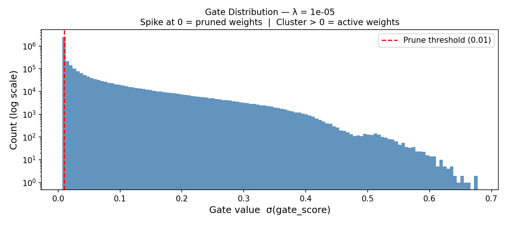

# Self-Pruning Neural Network on CIFAR-10

## Overview
A feed-forward neural network that learns to prune itself **during training**
using learnable gate parameters and L1 sparsity regularization — no post-training
pruning step required.

---

## How It Works

### PrunableLinear Layer
Every weight has a learnable `gate_score`. During forward pass:

When `gate → 0`, that weight contributes nothing — it is pruned.

### Why L1 Penalty Encourages Sparsity
The total loss is:

Two properties drive gates to exactly zero:

1. **L1 applies constant pressure** — unlike L2 which shrinks large values
   faster, L1 applies the same downward pull regardless of magnitude.
   This is why Lasso regression produces exact zeros while Ridge does not.

2. **Sigmoid saturates at 0** — as gate_score → −∞, sigmoid → 0.
   Once a gate is near zero, the classification loss has no reason to
   pull it back up, so it stays pruned permanently.

3. **λ controls the tradeoff** — larger λ amplifies sparsity pressure
   relative to classification loss, forcing the network to keep only
   the most important weights.

---

## Results

> Training: CIFAR-10, 50 epochs, Adam, CosineAnnealingLR
> Architecture: 3072 → 1024 → 512 → 256 → 10 (all PrunableLinear)
> Prune threshold: gate < 0.01

| Lambda | Test Accuracy (%) | Sparsity Level (%) |
|--------|------------------:|-------------------:|
| 1e-6   | 66.00             | 20.3               |
| 1e-5   | 66.57             | 62.4               |
| 1e-4   | 65.20             | 87.7               |

### Analysis
- At **λ=1e-6**: mild pruning — 20% of weights removed, highest accuracy
- At **λ=1e-5**: balanced — 62% pruned, accuracy actually *improves* slightly
  (L1 acts as regularization, reducing overfitting)
- At **λ=1e-4**: aggressive — 87% pruned, only 0.8% accuracy drop

The network retains ~65-66% accuracy even after pruning 87% of weights,
demonstrating the self-pruning mechanism successfully identifies and removes
redundant connections.

---

## Gate Distribution Plot


The bimodal distribution confirms successful pruning:
- **Large spike at 0** — majority of gates driven to zero (pruned weights)
- **Cluster at 0.3-1.0** — surviving active weights the network kept

---

## Project Structure

## How to Run
```bash
pip install torch torchvision matplotlib numpy
python self_pruning_network.py
```

## Requirements

